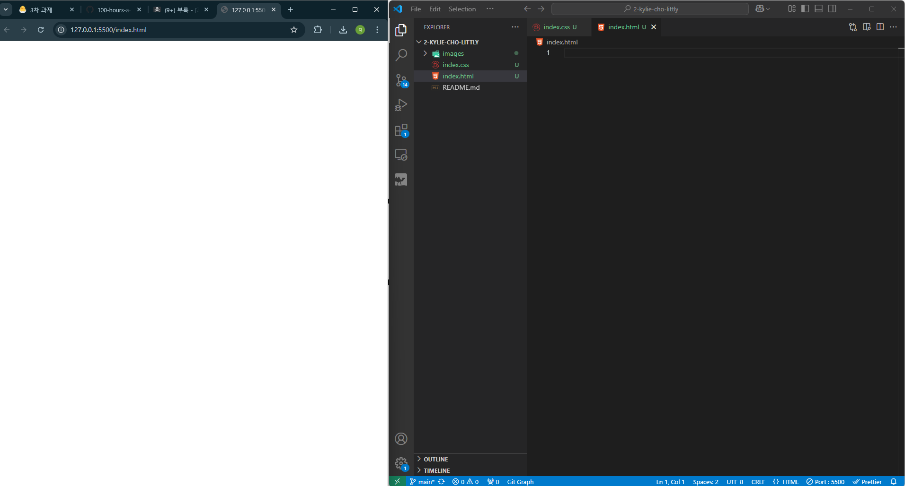
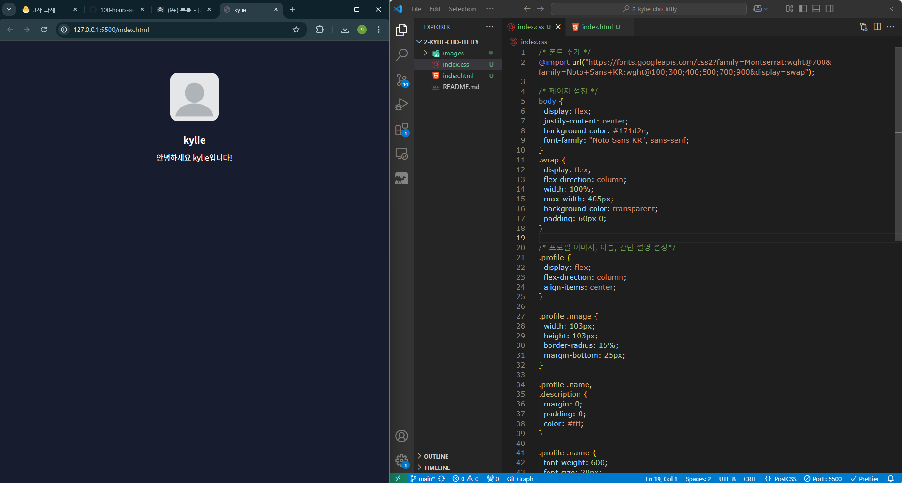
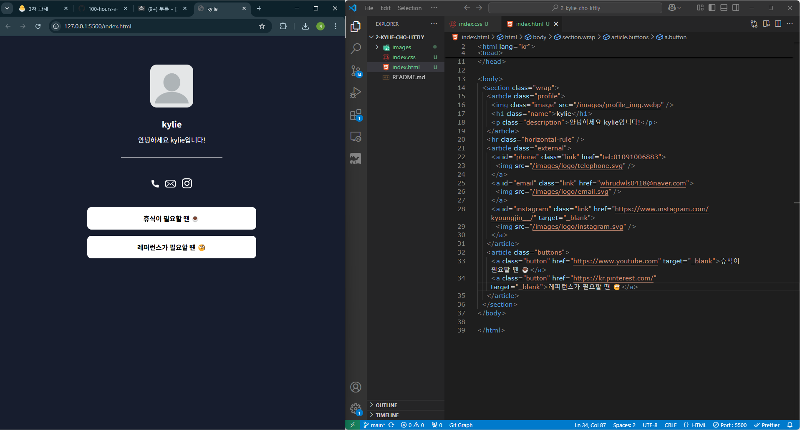
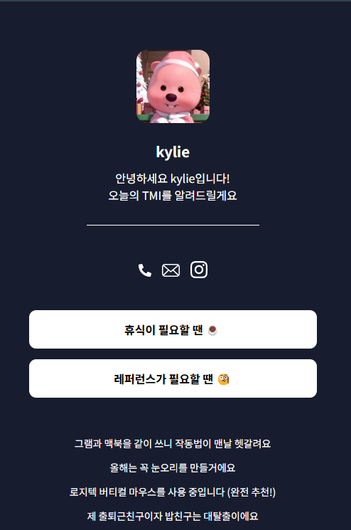
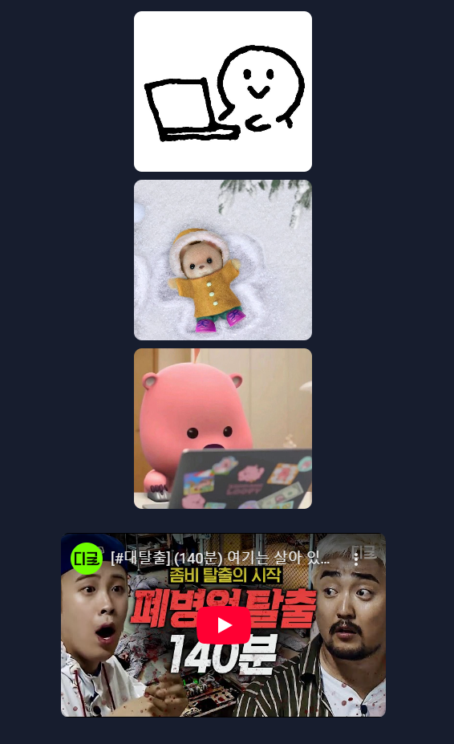

# Littly 만들기

> 카카오 부트캠프 풀스택 3차 과제 (1)

Frontend 과제를 시작하기 전 간단한 연습을 해보는 프로젝트입니다.

자기소개를 위한 페이지 레이아웃을 구현했습니다.

### 1단계

- VSCode 실행
- 폴더 및 파일 생성
- Live Server로 오픈

### 2단계

- HTML 기본 틀 잡기
- CSS 페이지 설정 및 폰트 설정
- 프로필

### 3단계

- 경계선 추가
- 연결
- 외부 링크 버튼

### 4단계

- 텍스트
- 사진
- 동영상

